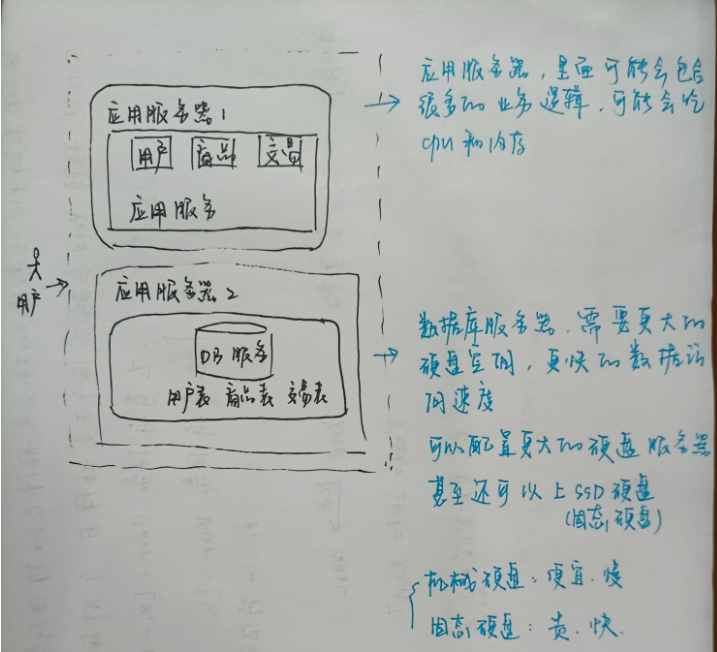
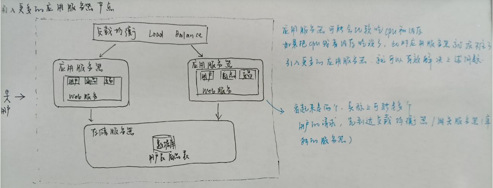
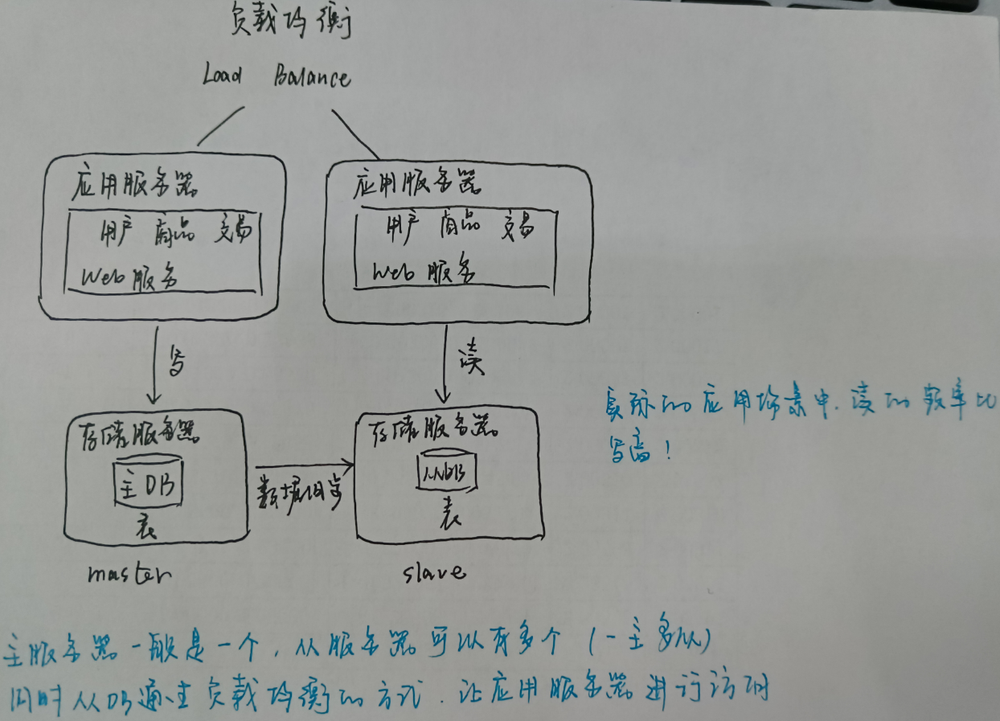
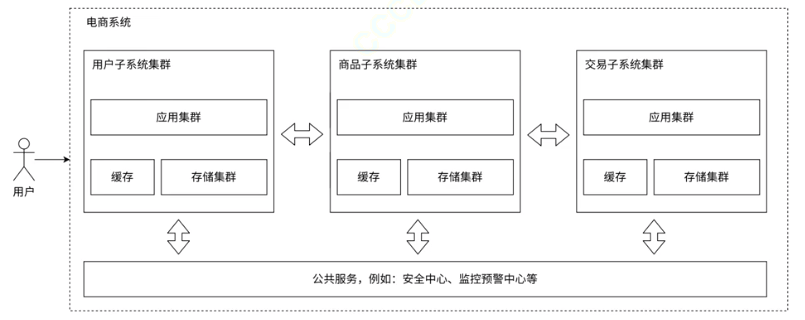

# 01.初识redis

## 一、Redis简介

**Redis** 是一种开源的 **内存** 数据结构存储系统，它可以用作数据库、缓存和消息中间件。如果只是单机程序，直接通过变量存储数据的方式，是比使用 redis 更优的选择。如果是分布式系统，想访问到其他进程的变量是非常困难的（进程的隔离性），redis 相当于针对上述需求点做了封装。**redis就是基于网络，可以把自己内存中的变量给别的进程，甚至别的主机的进程进行使用。**

- Mysql：访问速度慢
- Redis：作为数据库使用，访问速度快，但是存储空间有限
- 又大又快：最典型的方案，可以把 redis 和 MySQL 结合起来使用（用 redis 作为 MySQL 的 cache），把热点数据用 redis 来存储，把全量数据还是用 MySQL 来存储。（“二八原则”，即20%的热点数据满足80%的访问需求）。但是系统的复杂程度大大提升了，而且，当涉及到数据更新时，还需处理好 Redis 与后端数据库之间的同步问题，确保数据一致性。

虽然 Redis 最初设计目的是为了实现消息中间件（分布式系统下的生产者消费者模型）功能，但在现代分布式系统中，专门的消息队列产品（如RabbitMQ、Kafka等）往往更适合承担这一角色。

## 二、关于分布式

### 1.单机架构

单机架构，只有一台服务器，这个服务器负责所有的工作

单机程序中，能不能把数据服务器也去掉，光一个应用服务器又负责业务，又负责数据存储？（也不是不可以，但是就是会比较麻烦）

千万不要瞧不上这个东西，绝大部分公司的产品，都是这种单机架构！

现在的计算机硬件，发展速度非常之快，哪怕只有一台主机，这一台主机的性能也是很高的，可以支持非常高的并发和非常大的数据存储。

### 2.分布式架构

如果业务进一步增长，用户量和数据量都水涨船高，一台主机难以应付的时候，就需要引入更多的主机，引入更多的硬件资源。

一台主机的硬件资源是有上限的！！！包括但不限于一下几种（1.CPU 2.内存 3.硬盘 4.网络 5. …）服务器每次收到一个请求，都是需要消耗上述的一些资源的。如果同一时刻处理的请求多了，此时就可能会导致某个硬件资源不够用了。无论是哪个方面不够用了，都可能会导致服务器处理请求的时间变长，甚至于处理出错。

如果遇到了这样的服务器不够用的场景，该怎么处理。

- 开源——简单粗暴增加更多的硬件资源，但是一个主机上面能增加的硬件资源是有限的，取决于主板的扩展能力。一台主机扩展到极限了，但是还不够，就只能引入多台主机了。（不是说新的机器买来就可以解决问题了，也需要软件上做出对应的调整和适配）一旦引入多台主机了，系统就可以称为分布式系统了。**引入分布式，这是万不得已**，系统的复杂程度会大大提高
- 节流——软件上优化（各凭本事，需要通过性能测试，找到是哪个环节出了瓶颈，再去对症下药），但这对于程序员的水平要求较高

应用服务和数据库服务分离：

### 3.负载均衡器

负载均衡器，看起来不是承担了所有的请求嘛？这个东西能顶住嘛？

负载均衡器，对于请求量的承担能力，要远远超过应用服务器的。那是否可能会出现，请求量大到负载均衡器也扛不住了呢？也是有可能的，这时候就要引入更多的负载均衡器（引入多个机房）。

### 4.读写分离

上面讨论的增加应用服务器，确实能够处理更高的请求量。但随之存储服务器要承担的请求量也就更多了！

——引入更多的机器

### 5.冷热分离

数据库天然有个问题，响应速度比较慢！

把数据区分**冷热**，热点数据放到缓存中，缓存的访问速度往往比数据库要快很多了！

### 6.分库分表

引入分布式系统，不光要能够去应对更高的请求量（并发量），同时也要能应对更大的数据量。

一台服务器存不下数据时，就用多台主机来存储。

针对数据库进一步的拆分——分库分表

- 本来一个数据库服务器，这个数据库服务器上有多个数据库（指的是逻辑上的数据集合，create database 创建的那个东西）。现在就可以引入多个数据库服务器，每个数据库服务器存储一个或者一部分数据库
- 如果一个表特别大，大到一台主机存不下，也可以针对表进行拆分

### 7.微服务架构

之前的应用服务器，一个服务器程序里面做了很多的业务，这可能会导致一个服务器的代码变得越来越复杂。为了更方便代码的维护，就可以把这样的一个复杂的服务器，拆分成更多的，功能更单一的，但是更小的服务器。

微服务架构，本质是解决“人“的问题（方便人员组织划分）。但随之而来也会引入另一些问题：

- 系统性能下降（要想保证性能不下降太多，只能引入更多的机器，更多的硬件资源）
- 系统复杂程度变高，可用性受到影响（服务器更多了，出现问题的概率也更大了，因此需要一系列的手段来保证系统的可用性：更丰富的监控系统，以及配套的运维人员）

微服务的优势：

- 解决了人的问题
- 可以更方便功能的复用
- 可以给不同的服务进行不同的部署

### 8.一些概念

- 模块/组件

  一个应用，里面有很多个功能，每个独立的功能，就可以称为一个模块/组件

- 分布式（物理上多个主机）

  引入多个主机/服务器，协同配合完成一系列的工作

- 集群（逻辑上多个主机）

  引入多个主机/服务器，协同配合完成一系列的工作

- 主从

  分布式系统中的一种比较典型的结构，多个服务器节点，其中一个是主，另外的是从，从节点的数据要从主节点这里同步。

- 中间件

  和业务无关的服务（功能更通用的服务）

  - 数据库
  - 缓存
  - 消息队列

- 可用性

  系统整体可用的时间 / 总的时间，**一个系统的第一要务**

  （4个9：提供99.99%的可用性）

- 响应时长

  衡量服务器的性能，**越小越好**

- 吞吐/并发

  恒联系统处理请求的能力

**总之，Redis 是一个在内存中存储数据的中间件。用作数据库也可以用作数据缓存。**

## 三、Redis 的一些特性（优点）

- 在内存中存储数据

  以键值对的形式。

  > [!NOTE]
  >
  > Mysql 是以表的形式存储数据的，这种数据库称为关系型数据库；而 Redis 是以键值对的方式存储数据库的，这种不是以表的形式存储数据的数据库称为非关系型数据库。

- 可编程的

  针对 Redis 的操作，可以是通过简单的交互命令，也可以是通过一些脚本的方式，批量执行（Lua）。

- 扩展能力

  可以通过 C/C++/Rust 这几种语言编写 Redis 扩展（本质上是一个动态链接库）。

  可以自己扩展 Redis 的功能，比如：让 Redis 支持更多的数据结构以及支持更多的命令。

- 持久化

  内存的数据是易失的（比如：进程退出/系统重启），Redis 会把数据存储在硬盘上，内存为主，硬盘为辅。

- 集群

  一个 Redis 能存储的数据是有限的，引入多个主机，部署多个节点，每个 Redis 存储数据的一部分，这个水平扩展，类似于“分库分表”

- 高可用（冗余/备份）

  Redis 自身也是支持“主从”结构的，从节点相当于主节点的备份。

- 快

  为什么快？

  - 数据在内存

  - 核心功能都是简单的逻辑

  - 从网络角度来看，Redis 使用了 IO 多路复用的方式（epoll，使用一个线程，管理很多个 socket）

  - Redis 使用的是单线程模型（虽然更高版本的 Redis 引入了多线程），这样的单线程模型，减少了不必要的线程之间的竞争开销。Redis 主要的任务是操作内存的数据结构，不会消耗很多 CPU。

    > [!NOTE]
    >
    > 多线程提高效率的前提是 **CPU 密集型任务**，使用多个线程可以充分利用 CPU 的多核资源

  - Redis 是 C 语言开发的

## 四、Redis 的应用场景

### 1.redis 当作数据库

存全量数据

### 2.redis 当作缓存

存热点数据，全量数据以 Mysql 为主

### 3.会话存储

cookie 配合 session 完成跟踪浏览器用户身份的会话。cookie 实现用户身份信息的保存，只是在浏览器这边存储了一个用户身份标识（sessionId），session 则是在服务器这里真正存储了用户数据。

但是当应用服务器有多个时（由负载均衡器分配任务），每次用户登录可能被打到不同的应用服务器上，但是不同的应用服务器又没有其他服务器的会话信息。

这时如何解决？

- 想办法让负载均衡器，把同一个用户的请求始终打到同一个机器上（不能轮询了，而是要通过 userId 之类的方式来分配机器）

- 把会话单独拿出来，放到一组独立的机器上存储（如 Redis）

  

  万一应用服务器重启了，会话不丢失。

### 4.redis 当作消息队列

基于消息队列可以实现一个网络版本的生产者消费者模型。
